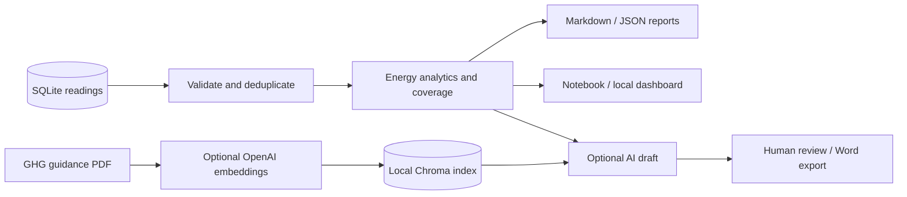

# EMS Co-Pilot

**Turn plant energy readings into traceable energy and carbon reports.**

EMS Co-Pilot is a single-plant analytics demo built around 2018 steel-industry interval data. It combines a read-only SQLite analytics engine, a guided notebook, an optional local dashboard, and an optional PDF-grounded AI assistant. Every report exposes its data coverage and duplicate handling alongside the results.

[Quick start](#quick-start) · [Notebook](EMS_Co_Pilot.ipynb) · [Usage](docs/USAGE.md) · [Architecture](docs/ARCHITECTURE.md) · [Data & methodology](docs/DATA.md)

## What you can do

- Audit the bundled database and identify duplicate observations before reporting.
- Explore daily totals, 15-minute peaks, load types, hour-of-day patterns and weekday/weekend usage.
- Compare complete periods of equal duration; unavailable comparisons stay explicit.
- Export deterministic Markdown or JSON reports without credentials or third-party packages.
- Optionally retrieve PDF guidance with Chroma and OpenAI embeddings, generate an AI draft with source-page references, and export Word reports.
- Browse deterministic reports through a Gradio interface on your own machine.

## Quick start

Python **3.10 or newer** is required. From a fresh checkout:

```bash
git clone https://github.com/adityashroff06-code/EMS-Co-Pilot-.git
cd EMS-Co-Pilot-
python -m ems_copilot audit --db ems.db
python -m ems_copilot report --start 2018-01-01 --end 2018-01-07
python -m ems_copilot report --start 2018-01-01 --end 2018-01-07 --format json --output reports/week-01.json
```

No installation, cloud account or API key is needed for these commands. Run them from the repository root. Outputs refuse to overwrite existing files.

The bundled audit reports **210,240 stored rows**, **35,040 unique 15-minute intervals**, and **175,200 exact duplicates excluded**. These are observations from the included database, not a performance benchmark. Exact duplicate rows are collapsed in memory; the database remains unchanged.

For notebooks, the local dashboard, or AI features, follow the separate [setup paths](docs/SETUP.md).

## How it works



Calculations remain deterministic. The optional language model receives a bounded analytics summary and retrieved evidence; generated recommendations require human review.

## Project map

| Path | Purpose |
| --- | --- |
| [`ems_copilot/`](ems_copilot/) | Tested analytics, CLI and optional AI/report helpers |
| [`EMS_Co_Pilot.ipynb`](EMS_Co_Pilot.ipynb) | Run-all-safe walkthrough; external actions disabled by default |
| [`app.py`](app.py) | Optional local dashboard |
| [`ems.db`](ems.db) | Original energy and carbon-intensity snapshot; opened read-only |
| [`docs/`](docs/) | Setup, usage, architecture, data and troubleshooting |
| [`tests/`](tests/) | Offline regression and mocked-provider checks |
| [`examples/first-week-report.md`](examples/first-week-report.md) | Report generated from the bundled database |

Historical report and vector-index archives remain for reference. See the [asset inventory](docs/DATA.md#bundled-assets) before using them.

## Validation and scope

```bash
python -m unittest discover -s tests -v
python scripts/check_notebook.py
```

The tests exercise duplicate inflation, conflicting readings, invalid values, calendar boundaries, missing coverage, period comparisons, CLI output and provider-response handling. CI runs offline checks without secrets. Live provider behavior and remote workflow execution are outside the local validation scope.

This is a documented, reproducible project demo. It does not implement production authentication, multi-plant ingestion, audited carbon accounting, automatic equipment control or regulatory reporting. The optional AI and UI dependencies use compatible version ranges rather than a fully locked deployment environment. [Known limitations](docs/ARCHITECTURE.md#limitations) explain the remaining work.

## Contributing and reuse

Read [CONTRIBUTING.md](CONTRIBUTING.md) for the development workflow and [SECURITY.md](SECURITY.md) before configuring credentials. No software license is currently declared. Third-party data and guidance retain their respective rights; see [data provenance](docs/DATA.md#provenance-and-rights).
